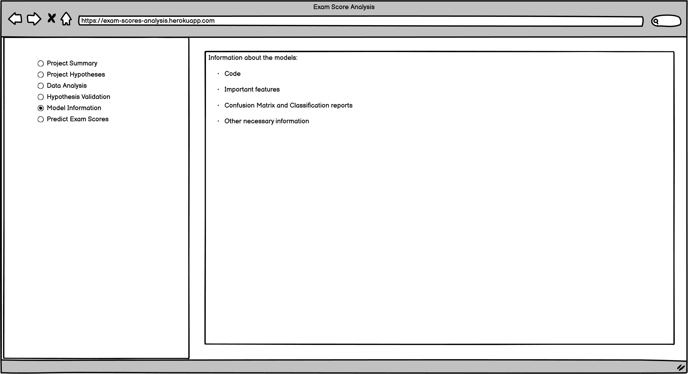

# Exam Scores Analysis

## Introduction

This is a Machine Learning project developed as part of my Predictive Analytics studies with Code Institute. This is my 5th Portfolio Project. It is based on a dataset of student exam scores.

The Project is both a data analysis and a machine learning application. The data analysis helps users understand what factors affect student exam results and to what degree. The machine learning application allows users to input student information and get predictions of how well they will do in their exams.

The project is deployed here:
https://student-exam-scores-analysis.herokuapp.com/

## Table of Contents

- [Introduction](#introduction)
- [Table of Contents](#table-of-contents)
- [Business Requirements](#business-requirements)
- [Dataset](#dataset)
- [Hypotheses](#hypotheses)
    - [Primary Hypotheses](#primary)
    - [Secondary Hypotheses](#secondary)
- [Dashboard pages](#dashboard-pages)
- [Mapping Business Requirements](#mapping-business-requirements-to-the-data-visualisation-and-machine-learning-tasks)
    - [Business Requirement 1](#business-requirement-1---data-visualisation-and-correlation-study)
    - [Business Requirement 2](#business-requirement-2---construction-of-an-appropriate-machine-learning-model)
    - [Business Requirement 3](#business-requirement-3---construction-of-streamlit-dashboard)
- [Notebook discussions](#notebook-discussions)
    - [Data Collection notebook](#data-collection-notebook)
    - [Data Analysis 1 notebook](#data-analysis-1-notebook)
    - [Data Analysis 2 notebook](#data-analysis-2-notebook)
    - [Data Analysis 3 notebook](#data-analysis-3-notebook)
    - [Correlation Study notebook](#correlation-study-notebook)
    - [Parallel Plots notebook](#parallel-plots-notebook)
    - [Feature Engineering notebook](#feature-engineering-notebook)
    - [Math Score Regression notebook](#math-score-regression-notebook)
    - [Math Score Classification notebook](#math-score-classification-notebook)
    - [Reading Score Classification notebook](#reading-score-classification-notebook)
    - [Writing Score Classification notebook](#writing-score-classification-notebook)
    - [Conclusions notebook](#conclusions-notebook)
    - [A note on label maps](#a-note-on-label-maps)
- [Hypothesis Validation](#hypothesis-validation)
    - [Primary Hypotheses Validation](#primary-hypotheses-validation)
    - [Secondary Hypotheses Validation](#secondary-hypotheses-validation)
- [Deployment](#deployment)
- [Wireframes](#wireframes)
- [Features](#features)
    - [Sidebar](#sidebar)
    - [Project Summary](#project-summary-page)
    - [Project Hypotheses](#project-hypotheses-page)
    - [Distribution Analysis](#distribution-analysis-page)
    - [Data Analysis Primary](#data-analysis-primary-page)
    - [Data Analysis Secondary](#data-analysis-secondary-page)
    - [Hypothesis Validation](#hypotheses-validation-page)
    - [Model Information](#model-information-page)
    - [Predict Exam Scores](#predict-exam-scores-page)
- [PEP8 Compliance Testing](#pep8-compliance-testing)
- [Credits](#credits)
    - [Technologies](#technologies)
    - [Libraries and Packages](#libraries-and-packages)
    - [Resources](#resources)
    - [Acknowledgements](#acknowledgements)

## Business Requirements

The local government wants to increase educational attainment in its schools, primarily by improving test scores in reading, writing and mathematics. They have access to data about past students' test scores, as well as information about those students' circumstances. The local government has contracted me to undertake 3 tasks:

- Firstly, they want me to study the student data to find patterns and relationships, with the goal of identifying what variables correlate to high test scores, and to what degree. These correlations will then be used to formulate educational policy with the aim of improving student test scores generally

- Secondly, they want me to produce a Machine Learning tool that their teachers can use to input data about a particular student and get a predictions of that student's test scores. Then, if those test scores fall below the mean of the historical test scores, that student can be offered additional support

- Thirdly, the local government has indicated that both the test scores analysis and the Machine Learning tool be held within a dashboard for ease of use

## Dataset

The local government uploaded the dataset to Kaggle. It is located [here](https://www.kaggle.com/datasets/whenamancodes/students-performance-in-exams).

Before any data analysis takes place, a quick inspection of the data indicates that it has value for a hybrid demographical-educational analysis of how student circumstances affect test scores.

## Hypotheses

After discussions with the local government, I have formulated several hypotheses. These hypotheses will guide the data analysis. I have 11 hypotheses total, and I have split them into Primary Hypotheses and Secondary Hypotheses.

The Primary Hypotheses are those that generally suppose some link between each of the 5 categorical variables and the numerical exam score variables. These are somewhat simple hypotheses, and validating them will fulfil the first business requirement.

The Secondary Hypotheses are those that generally suppose that certain pairs of categorical variables are correlated, such as the hypothesis that students of better educated parents have increased participation in the test preparation course. These hypotheses are more complex, and validating them could reveal insights about the demographics of the student body. These insights could allow me to better fulfil the first business requirement.

### Primary

- I hypothesize that a student's gender has an effect on their individual and overall test scores

- I hypothesize that a student's ethnicity has an effect on their individual and overall test scores

- I hypothesize that increased levels of parental education correlate with higher test scores. For this hypothesis, I have made the reasonable assumption that better educated parents have a greater focus on education

- I hypothesize that a student's lunch program has an effect on their test scores

- I hypothesize that students who attend the test preparation course attain higher test scores

### Secondary

- I hypothesize that increased levels of parental education correlate with increased participation in the test preparation course. As above, for this hypothesis, I have made the reasonable assumption that better educated parents have a greater focus on education

- I hypothesize that increased levels of parental education correlate with increased participation in the standard lunch program

- I hypothesize that a student's ethnicity has an effect on their parent's educational level. For this hypothesis, I assume that both parents are of the same ethnicity as their child. Put more simply, this hypothesis states that certain ethnicities are better educated that others

- I hypothesize that a student's ethnicity has an effect on their participation in the free/reduced school lunch program

- I hypothesize that a student's ethnicity has an effect on their participation in the test preparation course

- I hypothesize that a student's gender has an effect on their participation in the test preparation course

## Dashboard pages

This project will be deployed as a Streamlit dashboard. There will be 8 pages:

- Page 1 - A project summary page with an introduction, the project business requirements, and soem basic, surface-level information about the dataset and its variables
- Page 2 - The project's hypotheses, absent any validation
- Page 3 - A distribution analysis of the dataset, to determine whether the data is normally distributed
- Page 4 - Data Analysis as guided by the Primary Hypotheses, with plots that show the correlations between each of the categorical feature variables and the numerical target variables
- Page 5 - Data Analysis as guided by the Secondary Hypotheses, with plots that show the correlations and links between certain pairs of categorical variables
- Page 4 - The validation of the Project's hypotheses, based on any relevant findings identified in the data analysis pages
- Page 5 - Information about the predictive machine learning models that were trained 
- Page 6 - A user interface that allows the user to use the Machine Learning models to make predictions of student scores

## Mapping Business Requirements to the Data Visualisation and Machine Learning tasks

Now that the business requirements and data hypotheses have been laid down, it is now necessary to determine how the business requirements will be achieved and how the hypotheses will be validated

### Business Requirement 1 - Data Visualisation and Correlation Study
- Firstly, I will generally inspect the student test score data via a Pandas Profile Report
- Then I will conduct a distribution study, to determine if the data is normally distributed
- I will then conduct a data analysis guided by the project hypotheses. The Primary Hypotheses will be investigated first, followed by the Secondary Hypotheses
- I will then conduct a correlation study and Predictive Power Score analysis to determine which categorical variables have the greatest predictive power

### Business Requirement 2 - Construction of an appropriate Machine Learning model
- The local government wants to be able to predict student test scores based on their circumstances
- The local government wants 3 machine learning models - one to predict math scores, one to predict reading scores and another to predict writing scores 
- As the test scores are continuous numerical variables, a regression based model will be tried first
- As the feature variables are categorical, it may be that a regression model will fail to perform to an acceptable level
- If a regression model fails, a classification approach will be used, with student test scores converted to bins, with the best number of bins to be determined through extensive testing

### Business Requirement 3 - Construction of Streamlit dashboard
- Once all data analysis, data visualisation and machine learning tasks are completed, the focus of the project can switch to construction of the dashboard
- All necessary data analysis plots must be saved and inserted into the dashboard pages
- Appropriate commentary on those plots must be supplied
- Users must be be able to ineterface with the machine learning models so that they may make predictions by entering student parameters

## Notebook discussions

In this section I will discuss the various notebooks created and populated in the course of the project. The notebooks themselves have appropriate commentary, but they are long and hence the commentary is spread out. Discussing the notebooks here also allows me to lay down my thinking behind each notebook.

All of the notebooks were initially constructed from a single template that contains the code cells to set the working directory, and the markdown cells to outline the purpose of the notebook. Each notebook is independent, and does not rely on any other notebook, though if you have forked this project or used it as a template, them you must run the first notebook before any others, so that you can download the data from Kaggle.

### Data Collection Notebook

Notebook `01-data-collection.ipynb` deals with the collection of the dataset from Kaggle. [It can be accessed here](https://www.kaggle.com/datasets/whenamancodes/students-performance-in-exams). 

This notebook also contains some basic, surface-level data inspection. The dataset has 8 columns and 1000 rows. The first 5 columns have the object datatype, meaning that they contain categorical data. The last 3 columns have the int64 datatype, meaning that they contain numerical data.

After this basic inspection, I found it necessary to rename the columns for increased clarity and ease of use:
- `race/ethnicity` column renamed to `ethnicity`
- `parental level of education` column renamed to `parental_education`
- `lunch` column renamed to `lunch_program`
- `test preparation course` column renamed to `test_preparation_course`
- `math score` column renamed to `math_score`
- `reading score` column renamed to `reading_score`
- `writing score` column renamed to `writing_score`

I then added a column of my own called `average_score`, which averages the values in each of the 3 numerical datatype columns. This was done to provide an overall picture of a student's performance.

The final step of this notebook is to save the downloaded and modified dataset as a CSV file in the outputs/datasets/collection directory. As this code cell saves a file, there is terminal command that deletes an extant file of the same name, in case the notebook is being re-run.

### Data Analysis 1 Notebook

Notebook `02-data-analysis-1.ipynb` deals with a distribution study of the dataset. As noted in that notebook, I began with a distribution study so that I could determine whether or not the dataset's numerical variables were normally distributed. Machine Learning theory generally, and the Code Institute learning material specifically, states that machine learning models are easier to construct and train if the dataset they are working with is normally distributed. I therefore determined early on that it was essential to determine the distribution status before any machine learning work could begin.

The first part of the notebook concerns the construction of a Pandas Profile Report. From this I noted several things:
- The `gender` column is evenly distributed, as there are roughly 500 records each for male and female students
- The `ethnicity` column is unevenly distributed, as some ethnicities are more numerous than others
- The `parental_education` column is somewhat evenly distributed. There are approximately 200 records for each of the `some high school`, `high school`, `some college` and `associates degree` values, whilst there are only 112 records for the `bachelor's degree` value and 70 for the `master's degree` value
- The `lunch_program` column has about twice as many counts of the `standard` value as the `free/reduced` value
- The `test_preparation_course` column has about twice as many counts of the `none` value as the `completed` value
- I also noted that the small histograms plotted for the 4 numerical variables appear to show a classic bell shape, indicating normal distribution

My first step was to plot larger histograms of the numerical variables, and annotate them with KDE lines. Though these KDE line were rough, and had tails in some cases, they still showed the classic bell shape, which I took as a sign of normal distribution.

I then used the Pingouin library's Shapiro-Wilk test, which mathematically checks for normal distribution. This returned a negative result for all 4 numerical variables, meaning that the data was not normally distributed.

I then began exploring methods that could correct for this lack of normal distribution. My initial approach was to transform the data using the Box-Cox and Yeo-Johnson Transformers. I then re-ran the Shapiro-Wilk test on these transformed datasets, and again got negative results, indicating that those transformers had failed to normally distributed the data. To confirm this, I constructed QQ Plots of each numerical variable for each of the datasets - the original and the 2 transformed datasets. As with the KDE-histograms, these superfically appeared to show normal distribution going by the straightness of the lines and the exceptionally good R2 scores. However, closer inspections revealed that the lines are somewhat rough and wobbly, and also have significant bends toward the lower-left and upper-right. At this point, I was confused. I personally lack any significant education in statistics outside my Predictive Analytics studies, so I turned to the Slack Community for assistance. Niel McEwan was kind enough to respond, and indictated that the outliers may be having an out-sized effect, given the relatively small size of the dataset - 1000 records is considered small in predictive analytics.

With this advice, I began exploring the effect of removing various outliers, to see if I could get the Shapiro-Wilk test to return positive results. Initially I filtered out records with scores below 40, but this failed to improve distribution. I then conducted extensive testing, setting the cut-off point at each integer value between 20 and 40. In all cases, the Shapiro-Wilk test failed to return positive results. I then widened the analysis, and began filtering out students who score very highly. This failed to return positive Shapiro-Wilk results as well, and I stopped this line of enquiry when I noted that this was excluding large amounts of data, which would impact any attempt to train a model.

I ultimately concluded that the data was not normally distributed, and that nothing could be done to more normally distribute it. Nonetheless, I took the rough bell-shapes of the KDE-histograms and the exceptional R2 scores of the QQ plots to mean that the data is close enough to being normally distributed to allow me to continue, though I do concede that there may be some issues with training machine learning models.

The final part of this notebook is concerned with studying the skewness and kurtosis of the data. The skewness study revealed that the `math_score` variable is heavily skewed. The kurtosis study reveals that the math_score variable has a very highly positive kurtosis, indicating that the central peaks are too tall relative to the surrounding peaks. The reading_score and writing_score variables have very highly negative kurtosis, indicating that the data is too flat. These findings reinforce the conclusion that the data is not normally distributed, as such data would not show high skewness and kurtosis values.

The remaining code cells in the notebook deal with saving the relevant plots for use within the streamlit dashboard.

### Data Analysis 2 Notebook

Notebook `03-data-analysis-2.ipynb` deals with validation of the project's primary hypotheses - those that suppose a correlative link between each of the categorical variables and the numerical variables. Each section deals with a particular categorical variable. 

The relationships are examined via 4 barplots in each section, for 20 barplots overall. These barplots essentially average the scores in each numerical variable for each value of the categorical variable. For example, in the plot that examines the relationship between the test preparation course and reading score, there are 2 bars in the plot, one which shows the average reading score of students who have completed the test preparation course and another which shows the average reading score of students who have not completed the test preparation course. No specific calculations are performed to do this, as the Seaborn barplot function handles this itself. 

The MatPlotLib `bar_label()` method is used to add the values of the bars, allowing for a direct numerical comparison. I also set the plots to remove the error bars for a cleaner look

#### Gender

I began my studies with the `gender` column. This section contains 4 Seaborn barplots, where gender is plotted against each of the numerical variables. These plots show that male students perform better than female students in maths, and that female students perform better than male students in reading and writing. Since female students perform better than male students in 2 subjects, then on average they perform slightly better overall.

#### Ethnicity

The next section studies the `ethnicity` column. The plots show that ethnicity E performs the best, scoring the highest performance in maths and reading. In writing, ethnicity D edges out ethnicity E. On average, ethnicity E performs the best, closely followed by ethnicity D. Ethnicities C and D perform the worst in all 3 subjects and hence also on average.

#### Parental Education

The third section studies the `parental_education` column. The plots show a clear trend that as a student's level of parental education increases, their exam scores improve. The plots also show that there is a considerable difference in test scores between students whose parents have completed a high school education versus students whose parents only have some high school education. 

#### Lunch Program

The fourth section studies the `lunch_program` column. The plots show clearly that a student's lunch program has a large influence on their test scores. Those students on the standard lunch program perform significantly better than those students in the free/reduced lunch program.

#### Test Preparation Course

The last section studies the `test_preparation_course` column. The plots show that a student's participation in the test preparation course has a large influence on their test scores. Those students who complete the test preparation course achieve significantly higher scores.

### Data Analysis 3 Notebook

Notebook `04-data-analysis-3.ipynb` deals with the validation of the project's secondary hypotheses - those that suppose some link between pairs of categorical variables. Each section deals with a particular hypothesis and the associated pair of variables.

The first part of the notebook deals with data preparation. In order to properly investigate these relationships, I determined that I had to arbitrarily encode the categorical variables, which was accomplished using dictionaries that map each value to a number. I then dropped the numerical variable columns, as these were immaterial to the analysis.

I determined that the first step in determining any relationships was a correlation study using the `corr()` method. I then plotted these on a heatmap. This showed no significant correlations between the categorical variables.

I then considered that perhaps a more targeted study of the pairs of categorical variables in the hypotheses might reveal some correlative link. Determining the correct method for this proved difficult. I began with examining the parental_education and test_preparation_course variables.

#### Parental education - test preparation course

First, I used the `filter()` method to exclude all but the parental_education and test_preparation_course variables. I then used the `query()` method to produce 2 dataframes. The first contains only those students who have completed the test preparation course, and the second contains those students who have not completed the test preparation course. I then used the `value_counts()` method to calculate the counts of each value of parental_education in each of the dataframes. This is where I first ran into difficulties. Since the test_preparation_course variable is not evenly distributed, the Pandas series constructed by the `value_counts()` method could not be directly compared. I constructed barplots with number labels on them, but again, these could not be compared.

To circumvent this issue, I used the `normalize` attribute of the `value_counts()` method, and sorted the series by index. This produced Series that contain relative counts, similar to percentages. I then translated these series into dataframes, appending a third column that multiplies the normalised value counts by 100, which produces a more user-friendly percentage value.

These dataframes were then used to construct Seaborn barplots. As I note in the notebook and in the Streamlit dashboard, these two plots must be viewed together. The differences between the two indicate differences in the parental education of students who have completed and who have not completed the test preparation course. Overall, it appears that students who complete the test preparation course appear to have slightly better educated parents on average, which can be seen by the differences in height of the `high school`, `some college` and `associates degree` bars. However, as I note in the Streamlit dashboard, this correlative link is slight. It exists, but is not large.

Once I had the above method nailed down, I proceeded to examine the other hypotheses and the associated pairs of variables.

#### Parental Education - School Lunch program

In this section, I showed that the hypothesis that supposes a link between a student's parental education and the school lunch program they participate in is true but slight. This is demonstrated by the differences in bar size in the `some college` and `bachelor's degree` columns. It is therefore possible to say that students who participate in the standard lunch lunch program have slightly better educated parents overall.

#### Parental Education - Ethnicity

This section is longer than the others, as both of the variables under examination have more than 2 values. However, some interesting insights were gleaned by comparing the plots. Students of Ethnicity A appear to have more highly educated parents, closely followed by students of ethnicity B. Students of ethnicities D and E appear to have parents who are less well educated. Students of ethnicity C appear to have parents who have average levels of education. It is therefore possible to say that student ethnicity and parental education are linked - certain ethnicities are better educated.

This hypothesis is the only one that I can validate as definitively true, and that there is a large, noticably influence. The other secondary hypotheses are either only slightly true or false.

This particular study is very interesting when combined with the studies into how parental_education and ethnicity affect affect test scores.

I have established that parents of students of ethnicity A are highly educated. However, students of ethnicity A appear to perform relatively poorly in their exams. The same is true of students of ethnicity C, whose parents have middling education levels, and yet perform poorly in their exams. Conversely, students of ethnicities D and E have parents who are less well educated overall, and yet these students perform very well in their exams.

This is a curious thing to identify, though we do not have the data to make further judgements.

#### Ethnicity - Lunch Program

In this section, I showed that student ethnicity has a slight influence on their lunch program. The differences in bar height for ethnicity D and ethnicity E show this. There are no meaningful differences for the other ethnicities, hence the validation of true but slight.

#### Ethnicity - Test Preparation Course

In this section I showed that the hypothesis that a student's ethnicity influences their participation in the test preparation course is true but slight. Ethnic group A appears to participate in the test preparation course at a slightly higher rate, and ethnic group C appears to participate at a slightly lower rate.

#### Gender - Test Preparation Course

In this section I showed that the hypothesis that a student's gender influences their participation in the test preparation course is false. There is no meaningful difference in participation rates for each of the2 genders.

#### Conclusions

Based on these studies, I showed that the categorical variables are mostly independent. There is evidence of slight relationships between certain pairs of variables, and definite evidence of a link between parental education and ethnicity.

### Correlation study notebook

By this point, I had thoroughly investigated the dataset for correlations and relationships. Before moving onto the machine learning section of the project, I decided to conduct a general correlation study, so as to determine if any of the categorical variables had any particularly strong correlations with the numerical variables, as this may have influenced the model training process. 

To do this, I loaded the dataset and applied the One Hot Encoder, which is the normal way of preparing a dataset containing categorical variables for a correlation study.

I decided to use both the Pearson and Spearman correlation methods for each of the numerical variables. Unfortunately, the correlation studies only showed weak correlation levels (between 0.2 and 0.4) at maximum, and often considerably less than that.

For the math_score variable, both methods of the correlation study determined that the lunch_program variable has the highest correlation

For the reading_score variable, both methods of the correlation study determined that the lunch_program and test_preparation_course variables have the highest correlation

For the writing_score variable, both methods of the correlation study determined that the lunch_program and test_preparation_course variables have the highest correlation

I also conducted a Predictive Power Score study, so as to determine if any of the categorical variables had particularly strong predictive power over the numerical variables.

For the math_score variable, the Predictive Power Study indicated that the lunch_program variable has the greatest predictive power by far. This tallied with the second data analysis notebook, which indicated that lunch_program has a large effect on test scores.

For the reading_score variable, the Predictive Power Study indicated that the lunch_program variable has the greatest predictive power, though this technically under the threshold for strong predictive power.

For the writing_score variable, the Predictive Power Study indicated that the lunch_program and test_preparation_course variables had the strongest predictive power.

I determined that when training machine learning models that the lunch_program and test_preparation_course variables would probably feature heavily.

### Parallel plots notebook

I determined that, before begining the process of training machine learning models, that it would be useful to generate Parallel Plots to see how the categorical variables connects to each of the numerical variables. The idea was to reinforce the conclusion that the categorical variables were mostly independent, with only slight relationships between them, as was identified when validating the secondary hypotheses, and also to determine if I had missed any such relationships, as Parallel Plots show the entire dataset on one interactive plot. If I had missed any relationships, they would be visible by noticably clumps of lines between each y-axis.

Before I could construct parallel plots, I first had to sort the numerical variables into bins. I easily appropriated the code from the Churnometer Walkthrough Project to do this. To improve user-friendliness, I also renamed the bins, again using code from the Churnometer project.

Once that had been done, I constructed the parallel plots. These prove that the identified relationships between the categorical variables are slight, as noted, since no patterns can be easily discerned in any of the three parallel plots.

### Feature engineering notebook

Once the parallel plots had been constructed, I decided that there was nothing more that needed to be done regarding the data analysis portion of the project, and that I could move my focus to training machine learning models.

Prior to this, I decided to undertake some feature engineering work. Primarily, this involved the use of the `SmartCorrelatedSelection()` method to determine if any feature variables were correlated enough that they needed to be dropped prior to fitting a model. In a way, this served as a further reinforcement of the conclusion that the categorical feature variables were independent.

Before I conducted the Smart Correlated Selection, I first created created 3 dataframes from the original, one for each of the numerical variables. I then split each of these into train and test sets.

Once that was done, I used the OrdinalEncoder to encode the categorical variables as integers. I then used the `SmartCorrelatedSelection()` method to determine if there were any features to drop. Fortunately, and in line with our previous analyses, none of the categorical variables needed to be dropped. I therefore concluded that any machine learning pipelines developed in this project would not need a SmartCorrelatedSelection step.

### Math score regression notebook

Notebook `08a-math-score-model-regression.ipynb` deals with my first attempt to train a machine learning model to predict the math_score variable. My thought process was that, because the math_score variable is a continous numerical variable, that a regression model would be the best approach, with the goal of being able to predict a student's exact math score. Given that this was my first real attempt to train a machine learning model myself, I decided to closely follow the workflow presented in the Predict Tenure Notebook of the Churnometer walkthrough project.

I first loaded the dataset, and removed the reading_score, writing_score and average_score variables. I then split that dataset into train and test sets, using a standard 20% of the data for the test set.

I then defined the pipeline. From the Feature Engineering notebook, I knew that any pipelines would not require a SmartCorrelatedSelection step. I therefore decided to include an OrdinalCategoricalEncoder step, a FeatureScaling step, a FeatureSelection step, and finally a Model step.

I then defined the custom HyperparameterOptimizationSearch class, taken directly from the Churnometer project. I then defined 2 dictionaries - one to hold the regression algorithms, and a second to hold the default hyperparameters of those algorithms.

I then called that HyperparameterOptimizationSearch class to fit models using the algorithms and those algorithms' default hyperparameters. After these models had been fitted, I inspected the results.

The results dataframe showed that all of the algorithms had very poor performance across the board. The LinearRegression algorithm performed best with a mean score of 0.24. The RandomForestRegressor performed next best with a score of 0.22. Given that the next step of the workflow was to optimise the hyperparameters, and given that the LinearRegressor has no hyperparameters to optimise, I decided to take both top performers forward for further consideration. I defined new dictionaries - one to hold the RandomForestRegressor and another to hold the RandomForestRegressor's hyperparameters. I then called the HyperparameterOptimizationSearch again using these new dictionaries, fitting models using the RandomForestRegressor and various combinations of hyperparameters.

When I inspected the results, I was disappointed to find that the RandomForestRegressor had only seen a slight increase in mean_score to 0.24.

I then proceeded to assess feature importance, which was only possible with the RandomForestRegressor. Feature importance was assessed using the code block taken directly from the Predict Tenure notebook of the Churnometer Walkthrough project. This code showed that the lunch_program, ethnicity and parental_education variables were the most important features, and of these, showed that the lunch_program variable was the most important. This tallies with the conclusions drawn in the data analysis notebooks.

I then moved on to the workflow step of evaluating performance on the train and test sets, again using a code cell of three functions taken directly from the Predict Tenure notebook of the Churnometer project.

I called these functions twice, one for the LinearRegressor and again for the RandomForestRegressor. Per the walkthrough project videos, I was primarily interested in the R2 scores. In both cases, these were poor - 0.261 and 0.122 for the train and test sets respectively for the LinearRegressor, and 0.298 and 0.19 for the train and test sets respectively for the RandomForestRegressor. The plots were also poor, with no real pattern discernable.

Per the Churnometer project, I considered trying a Principal Component Analysis. In the Churnometer project, the Principal Component Analysis delivered somewhat improved performance. However, I determined that, even if the performance of my model improved by the same amount, that the performance would still not be good enough. I therefore decided to abandon my attempts to train a regression model and instead converted to training a classification model instead. 

### Math score classification notebook

Notebook `08b-math-score-model-classification.ipynb` deals with my second attempt to train a model to machine learning model to predict a student's math score. After the poor performance of regression-based models, I hoped that a classification model would provide better performance. As with training a regression model, I decided to closely follow the workflow as presented in the Churnometer project.

A classification model for this dataset required that students should be sorted into bins or classes. The Churnometer project immediately moves into using 3 bins. I considered using the same approach, but then I decided that it would be a good idea to explore the outcome of using 4 bins as well. Later on in development, I decided to go back over this notebook and explore a 2-bin binary classification approach as well.

As I would be essentially repeating the same workflow, just with different numbers of bins, I decided to apply an object-oriented approach. I defined the following once:
- the HyperparameterOptimizationSearch class
- the classification pipeline
- the dictionaries holding the classification algorithms and the default hyperparameters
- the functions for constructing confusion matrices and classification reports

This was done so that I would not have to define these again in each section, lengthening a notebook that was already shaping up to be very long.

I then moved on to preparing the dataset for a 3-bin classification approach. Still following the Churnometer project closely, I used the EqualFrequencyDiscretiser to discretise the math_score variable into 3 bins. I then split the discretised dataset into train and test sets. I then called the HyperparameterOptimizationSearch class to fit models, and inspected the results. The DecisionTreeClassifier algorithm performed best, with a mean_score of 0.62. 

I then moved on to optimising the DecisionTreeClassifier algorithm's hyperparameters. To do this, I defined 2 new dictionaries - one to hold the DecisionTreeClassifier and another to hold the hyperparameters to try. I then called the HyperparameterOptimizationSearch class again and inspected the results. The results were somewhat disappointing, as optimising the hyperparameters had failed to improve the DecisionTreeClassifer's performance.

I then moved on to assessing the feature importance, again re-using the code block from the Churnometer project. The plot produced by this code indicated that the DecisionTreeClassifier had been trained on the ethnicity and parental_education variables. This was interesting, since my data analysis studies had shown that the lunch_program variable had a larger influence on performance than these variables, so I was surprised to see it missing.

The next step in the workflow was to construct a classification report and confusion matrix. I called the clf_performance function that had been defined at the top of the notebook. Per the Churnometer project, I decided to take the Recall score on the lowest-scoring class as the most important metric, as the entire point of the project is to be able to predict these students. For the train set, the Recall score was 0.62 and for the test set, it was 0.63. At the time, I considered this to be acceptable performance, if not stellar.

I then repeated the above workflow for the 4-bin approach. The 4-bin approach used the XGBClassifer algorithm, and hyperparameter optimisation failed to improve performance. Interestingly, the feature importance section identified the lunch_program variable as being the only feature the model was trained on. The classification report showed poor performance. The Recall score on the lowest-scoring class was 0.60 and 0.58 for the train and test set respectively, but was 0 for the two middle classes, indicating that the model had failed to predict these classes. 

At the time of training the 3-bin and 4-bin approaches, I decided to proceed with using the 3-bin approach, thanks to the superior recall scores. However, later on as I was writing my conclusions and preparing to code the Streamlit dashboard, I decided to explore the 2-bin binary classification approach. I used the same workflow as above, and identified the DecisionTreeClassifier as the best algorithm, though hyperparameter optimisation failed to improve performance. Feature importance analysis identified the lunch_program, ethnicity and parental_education variables as the most important. The classification report showed recall scores of 0.68 and 0.51 on the train and test sets respectively.

At this point, I was faced with a decision as to which model to use in the Dashboard. Both had their advantages. The 2-bin approach offered better recall scores and hence better predictive power, whereas the 3-bin approach offered finer classification. I ultimately decided that the 2-bin approach was the one to take forward, as I was interested in making predictions that were as accurate as possible.

I then conducted a final model fitting process, using a new pipeline without a feature selection step, since I had already identified the most important feature variables.

I then saved the discretised and filtered train and test sets, the pipeline, the label map and the feature importance plot.

### Reading score classification notebook

Notebook `08c-reading-score-model.ipynb` deals with my attempt to train a model to predict a student's reading score. Initially, I considered using the same workflow as with training a math_score model, using a regression approach first with the option of converting to a classification approach. However, given the very poor performance of the math_score regression model, I considered it likely that a reading_score regression model would perform equally as poorly. In order not to waste time, I immediately pursued training a classification model.

As with the math_score classification model, I initially trained models using 3-bin and 4-bin approaches. The 3-bin approach yielded recall scores for the lowest-scoring class of 0.67 and 0.68 for the train and test sets respectively, and used the RandomForestClassifier, which was trained on the ethnicity and parental_education variables.

The 4-bin approach yielded recall scores for the lowest-scoring class of 0.51 and 0.57 for the train and test sets respectively, and used the ExtraTreesClassifier, which was trained on the ethnicity and parental_education variables.

Based on this performance, at the time of model training, I took the 3-bin approach forward. Later on, as with the math_score notebook, I went back over the reading_score notebook and explored the binary 2-bin approach. This yielded recall scores for the lowest-scoring class of 0.88 and 0.85 for the train and test sets respectively, and used the XGBClassifier algorithm, which was trained on the lunch_program and test_preparation_course variables. I was frankly staggered by these recall scores, which indicate excellent predictive power. I immediately decided to take the 2-bin approach forward. I conducted a final fitting process, using a new pipeline without a feature selection step, and then saved the discretised and filtered train and test sets, the pipeline, the label map and the feature important plot.

Later on, as I was going back over the project in the final clean-up phase of the project, I noted that I had defaulted to using the EqualFrequencyDiscretiser in the 2-bin approach. This works well in the math_score notebook, since the break-point between the 2 classes occurs at a math_score of 66.5. The mean value of the math_score is 66.4, which allowed me to label the 2 classes as `below average` and `better than average`. This was not true of the reading_score notebook, where the EqualFrequencyDiscretiser splits the classes at a reading_score of 70, whereas the mean value is 69. Ideally, I wanted the break-point between the classes to be at the mean value, so that I could label them as `below average` and `better than average`, so as to deliver a unified user experience in the dashboard. I therefore decided to explore the outcome of an alternative 2-bin approach using the ArbitraryDiscretiser, manually setting the breakpoint at the average value.

I used the same workflow as in the previous 2-bin approach. However, I was unfortunately disappointed that the recall scores on the lowest-scoring class were 0.49 and 0.55 for the train and test sets respectively. Given that the objective was to maximise recall scores on the lowest-scoring class, I abandoned this approach and kept using the 2-bin approach using the EqualFrequencyDiscretiser.

### Writing score classification notebook

Notebook `08d-writing-score-model.ipynb` deals with my attempt to train a model to predict a student's writing score. At this point, having trained 2 classification models, I immediately decided to use a classification model for the writing_score variable. As with the previous notebooks, I initially used 3-bin and 4-bin approaches.

The 3-bin approach produced recall scores on the lowest-scoring class of 0.68 and 0.71 for the train and test sets respectively, and used the ExtraTreesClassifier algorithm trained on the ethnicity and parental_education variables.

The 4-bin approach produced recall scores on the lowest-scoring class of 0.45 and 0.48 for the train and test sets respectively, and used the XGBClassifier algorithm trained on the lunch_program and test_preparation_course variables.

Based on this performance, at the time of model training, I took the 3-bin approach forward. As with the other 2 notebooks, I later went back over and explored the 2-bin approach. This yielded recall scores on the lowest performing class of 0.98 and 0.96, and used the GradientBoostingClassifier trained on the lunch_program, test_preparation_course and parental_education variables. I was amazed by these recall scores, which indicate near-perfect predictive power. I immediately decided to take the 2-bin approach forward. I conducted a final fitting process using a new pipeline without the feature selection step, and then saved the filtered and discretised train and test sets, the pipeline, the label map and the feature importance plot.

Later on, as with the reading_score notebook, I explored an alternative 2-bin approach using the ArbitraryDiscretiser for the same reasons as above, as the mean value of the writing_score variable is 68. As the difference between the 2 discretised datasets is a single point, the recall scores on the lowest-scoring class using this approach were 0.91 and 0.87 for the train and test sets respectively. The algorithm was the XGBClassifier trained on test_preparation_course and lunch_program variables, interestingly with the test_preparation_course variable being more important than the lunch_program variable.

The similarity between the recall scores of both 2-bin approaches gave me pause, and seriously considered using the alternative approach. However, I remembered that the objective was to maximise recall scores, so I stuck with the original 2-bin EqualFrequencyDiscretiser approach and its superior recall scores.

### Conclusions notebook

Notebook `09-conclusions.ipynb` rounds up all of my observations during the model training process. I decided the transpose the confusion matrices and classification reports from all three classification model notebooks into markdown table format. I then discussed my observations.

### A note on label maps

Though the machine learning models are all 2-bin classification models trained on datasets discretised using the EqualFrequencyDiscretiser, they have different label maps, or names for the 2 classes. This is because of where the split (or break-point, as I call it) between the classes in the EqualFrequencyDiscretiser occurs:

- In the math_score model, the split occurs at 66.5. The mean value of the math_score is 66.4. As a decimal value, no student can exactly score the mean value, so I have designated the classes as **below average** and **above average**.

- In the reading_score model, the split occurs at 70, where the mean value is 69. Therefore, students can score the mean score. Those who do are sorted into the lower-scoring class. Hence, I have designated the classes as **average or below** and **better than average**. This is not ideal, but as I have described above, the attempt to set the break-point manual using the ArbitraryDiscretiser produced poor recall scores, and so was not used.

- In the writing_score model, the split occurs at 68, where the mean value is 67.7. As a decimal value, no student can exactly score the mean value, so I have designated the classes as **below average** and **above average**.

## Hypothesis validation

Each of the project's hypotheses are validated in the sections of notebooks `03-data-analysis-2` and `04-data-analysis-3` that examine them. The hypotheses are also validated in the Hypothesis Validation page of the [Streamlit dashboard](https://student-exam-scores-analysis.herokuapp.com/). However, since the hypotheses are laid down in the Readme, it is useful to validate them here as well.

### Primary Hypotheses Validation

#### Hypothesis 1

I hypothesized that students who attend the test preparation course attain high test scores. This is true. The difference in performance improvement varies by subject, between 5 and 10 points, with the average improvement being 7.5 points.

#### Hypothesis 2

I hypothesized that the lunch program that a student participates in has an effect on their test scores. This is true. The difference in performance improvement varies by subject. Reading and writing see an improvement of 9 points, whereas maths sees an improvement of 12 points.

#### Hypothesis 3

I hypothesized that students with increased levels of parental education score better. This is true. Students of better educated perform better, with performance increasing as parental education levels increase. There is also a noticable increase in performance between students whose parents have only some high school education and students who have completed a high school education.

#### Hypothesis 4

I hypothesized that a students' gender has an effect on their test scores. This is true. Female students perform better than male students in reading by 5 points and in writing by 7.5 points. Male students perform better than female students in maths by 6.5 points. 

#### Hypothesis 5

I hypothesized that a student's ethnicity has an effect on their test scores. This is true. Ethnicity groups D and E perform the best in all subjects, whereas ethnicity groups B and C perform the worst in all subjects.

### Secondary Hypotheses Validation

#### Hypothesis 6

I hypothesized that increased levels of parental education correlate with increased participation in the test preparation course. This is slightly true. Students of better educated parents participate in the test preparation course at slightly higher levels.

#### Hypothesis 7

I hypothesized that increased levels of parental education correlate with increased participation in the standard lunch program. This is slightly true. Students of better educated parents participate in the standard lunch program at a slightly higher rate.

#### Hypothesis 8

I hypothesized that a student's ethnicity has an effect on their parent's educational level, or put more simply, that students of certain ethnicities have parents who are better educated. This is true, and not just slightly true. Students of ethnicity groups A and B have parents who are noticably better educated, whereas students of ethnicity groups D and E are noticably less well educated.

#### Hypothesis 9

I hypothesize that a student's ethnicity has an effect on their school lunch program, or put more simply that certain ethnicities participate in the different programs at different rates. This is slightly true. Students of ethnicity D participate in the standard lunch program at a higher rate, whereas students of ethnicity E participate in the free/reduced lunch program at a higher rate. Ethnicity groups A, B and C have no real difference in lunch program participation rates.

#### Hypothesis 10

I hypothesized that a student's ethnicity has an effect on their participation in the test preparation course. This is slightly true. Ethnicity group C completes the test preparation course at a slightly lower rate, whereas ethnicity group A completes the test preparation course at a slightly higher rate.

#### Hypothesis 11

I hypothesizes that a student's gender has an effect on their participation in the test preparation course. This is false. Both genders participate in the test preparation course at almost exactly the same rate.

## Deployment

The project is deployed here:
https://student-exam-scores-analysis.herokuapp.com/

When conducting deployments on Heroku, I noticed the following warning message:
`Warning: Your slug size (418 MB) exceeds our soft limit (300 MB) which may affect boot time.`

When I load the dashboard outside of Heroku, it takes about 30 seconds to load, but this appears to be the only consequence of the warning message. The app also takes about 30 seconds to load when accessed from my mobile device.

When deploying the project, I ran into a small bug. Heroku defaults to the Heroku-22 stack, whereas the project uses Python 3.8.11, which are incompatible with each other. Therefore, if you have forked this repository or are using it as a template, be sure to install the Heroku CLI and set the stack to Heroku-20.

## Wireframes

Below are the wireframes I constructed early on in development for how I initially conceived the dashboard to look. The final design ended up being considerably different. Firstly, there are 2 additional pages, a result of deciding to split the data analysis page into 3 separate pages, in the same vein as the data analysis notebooks. Secondly, the model interface page looks different, a result of a closer inspection of the Churnometer project's code for making predictions.

### Project Summary

### Project Hypotheses

### Data Analysis

### Hypothesis Validation

### Model Information

### Model Interface

## Features

This section discusses the various features of the Streamlit Dashboard, with screenshots of the pages.

### Sidebar

The sidebar is used for navigation around the dashboard.

### Project Summary page

The Project Summary page contains an introductory section, the project's business requirements and some information about the dataset

### Project Hypotheses page

The Project Hypothesis page contains the project's 5 primary and 6 secondary hypotheses. Validation of these hypotheses is handled separately.

### Distribution Analysis page

The Distribution Analysis page documents my initial exploration of the dataset, and my attempt to determine whether or not the data is normally distributed.

The Distribution Analysis page contains: 
- the input and output datasets
- distribution KDE-histograms for the 4 numerical variables
- QQ Plots for each of the 4 numerical variables
- The results of the Shapiro-Wilk normal distribution test
- My discussions about the normal distribution of the data

### Data Analysis Primary page

The Data Analysis Primary page documents my data analyses as guided by the primary hypotheses. There are 5 primary hypotheses, and the page has a section for the exploration of each hypothesis. Each section contains 4 plots, one for each numerical variable.

### Data Analysis Secondary page

The Data Analysis Secondary page documents my data analyses as guided by the Secondary hypotheses. There are 6 secondary hypotheses, and the page has a section for the exploration of each hypothesis. 5 of the sections contain 2 plots and the other contains 5 plots, for 15 plots total. As noted in the dashboard page and in the notebooks, the plots in each section must be viewed together.

### Hypotheses Validation page

The Hypothesis Validation page documents my validation of the project's hypotheses. Each hypothesis has its own section, coloured to indicate the nature of the hypothesis's validation:
- Green backgrounds indicate hypotheses validated as absolutely true
- Yellow backgrounds indicate hypotheses validated as slightly true
- Red backgrounds indicate hypotheses validated as false

### Model Information page

The Model Information page documents the 3 machine learning models trained during the project. There are 3 sections - one for each model. Each section contains:
- A discussion of the model training process
- The code for the pipeline that was constructed
- A plot of the features the model was trained on with their relative performances
- A confusion matrix and classification report for the train and test sets
- A final discussion of the confusion matrix and classification report

### Predict Exam Scores page

The Predict Exam Scores page fulfils business requirement 2, and allows users to use the machine learning models to make predictions. All the user needs to do is select the variable values that describe a student and press the **Make Predictions** button. The predictions will be displayed below in bold. Where the prediction is uncertain, the probability is displayed as well.

## PEP8 Compliance Testing

The project contains a number of Python files. I therefore conducted validation of these using [Code Institute's Python Linter](https://pep8ci.herokuapp.com/). The results are below.

#### App Pages

##### Project Summary page

No errors were detected

##### Project Hypothesis page

No errors were detected

##### Distribution Analysis page

Some line too long errors were noted. These were corrected.

##### Data Analysis Primary page

No errors were detected

##### Data Analysis Secondary page

Several line too long errors related to importing images. Left uncorrected so to not disrupt image loading

##### Hypothesis Validation page

No errors were detected

##### Model Information page

3 line too long errors detected related to loading images. These were left uncorrected so as to not disrupt image loading

##### Predict Exam Scores page

No errors were detected

##### Multipage page

No errors were detected

#### SRC directory

##### Data Management

Some line too long errors - corrected

##### Machine Learning Evaluate CLF

No errors

##### Machine Learning Predictive Analysis Interface

Some line too long errors were detected. These were corrected.

#### Jupyter Notebooks

Throughout development, I ran each of the project's Jupyter Notebooks many times. On ocassion, errors were found, and these were always due to changed variable names or missing imports. Running the notebooks without issue is proof that they work as intended. The model training cells can take up to several minutes to execute, but this is to be expected.

## Credits

This section holds all of the resources, links, people, libraries, packages and so on that helped build this project

### Technologies

- Github was used to create the project's repository and store the project's files

- Gitpod was used to create and edit the project's files

- Heroku was used to deploy the project

- Slack was used to communicate my Mentor

- Balsamiq was used to create wireframes of the project's dashboard

- Kaggle was used to source the dataset for this project, and provide an API token allowing it to be downloaded

### Libraries and Packages

- [NumPy](https://numpy.org/) was used for basic mathematical operations such as standard deviations and mean values

- [Pandas](https://pandas.pydata.org/) was used for many operations:
    - Loading CSV files into Series and Dataframes
    - Saving Series and Dataframes as CSV files
    - Creating and modifying Series and Dataframes
    - Creating a Pandas Profile Report to initially explore the data
    - The correlation method for conduction the correlation study

- [MatPlotLib](https://matplotlib.org/) and [Seaborn](https://seaborn.pydata.org/) were used for constructing plots to visualise my data analyses, in particular countplots and barplots

- [Plotly](https://plotly.com/python/) was used for constructing interactive plots to visualise my data analyses, in particular several parallel plots

- [Feature Engine](https://feature-engine.readthedocs.io/en/1.1.x/) was used for machine learning tasks:
    - The OrdinalEncoder allowed me to encode categorical variables within the various pipelines used in this project
    - The EqualFrequencyDiscretiser and ArbitraryDiscretiser modules enabled me to discretise the datasets for the classification tasks
    - The OneHotEncoder enabled me to encode the dataset for the correlation study 
    - The Box-Cox and Yeo-Johnson transformers were used to transform the data in an effort to make it more normally distributed 

- [SciKit Learn](https://scikit-learn.org/stable/) was used for many machine learning tasks:
    - Provided the various algorithms used to train the regression and classification model
    - Pipeline for building machine learning pipelines
    - SelectFromModel for feature selection steps in the pipelines
    - Train-Test Split for creating train and test sets
    - Make Scorer and Recall Score for assessing algorithm and hyperparameter performance
    - Classification Report and Confusion Matrix for constructing classification reports and confusion matrices for assessing model performance

- [XGBBoost](https://xgboost.readthedocs.io/en/latest/index.html) provided the XGBoost Regressor and XGBoost Classifier algorithms 

- [Pinguoin](https://pingouin-stats.org/api.html) was used for the Shapiro-Wilk test for normal distribution

- [Predictive Power Score](https://github.com/8080labs/ppscore) was used for conducting a Predictive Power Score analysis

### Resources

The following resources were used to assist in the construction of this project:

- The dataset used in this project is located [here](https://www.kaggle.com/datasets/whenamancodes/students-performance-in-exams). Many thanks to [Aman Chauhan](https://www.kaggle.com/whenamancodes) for creating and uploading this dataset

- [My Fork of the Churnometer Walkthrough Project](https://github.com/AdamBoley/churnometer) proved to be of immense assistance. Firstly, I took several code blocks from it, which were used in the regression and classification model training. These are:
    - The HyperparameterOptimizationSearch class, used for testing several algorithms and their hyperparameters
    - The functions for generating a classification report and a confusion matrix
    - The code for assessing feature importance

- Secondly, the Churnometer project provided a general structure for me to follow in planning and executing this project. The idea of conducting a machine learning project was daunting early on, and following the workflow of the Churnometer project was useful in getting this project off the ground so that I could settle into it and make it my own

- [This StackOverflow Question](https://stackoverflow.com/questions/34734940/row-wise-average-for-a-subset-of-columns-with-missing-values) helped me calculate average row values in a dataframe, and hence was useful when adding the average_score column to the dataset

- [This StackOverflow Question](https://stackoverflow.com/questions/40088585/turn-off-error-bars-in-seaborn-bar-plot) helped me add numerical values to barplots and remove errors bars

- [This StackOverflow Question](https://stackoverflow.com/questions/34615854/seaborn-countplot-with-normalized-y-axis-per-group) helped me construct Seaborn countplots with normalised counts on the y-axis

- [This tutorial](https://www.hostinger.co.uk/tutorials/how-to-remove-files-and-folders-using-linux-command-line/#:~:text=To%20permanently%20remove%20a%20directory,use%20rm%20%2Dr%20%5Bdirname%5D) provided the Linux terminal commands to remove directories and files, which were of particular use when creating directories and saving files

- [This Uk Government webpage](https://assets.publishing.service.gov.uk/government/uploads/system/uploads/attachment_data/file/936220/Retaining_the_current_grading_system_-_arguments_and_evidence_290419.pdf) helped me think about the number of bins to use in the ML classification tasks

- [This TowardDataScience article](https://towardsdatascience.com/multi-class-metrics-made-simple-part-i-precision-and-recall-9250280bddc2) and [its companion](https://towardsdatascience.com/multi-class-metrics-made-simple-part-ii-the-f1-score-ebe8b2c2ca1) helped me understand the precision and recall metrics used in the classification reports and confusion matrices

- [This MatPlotLib documentation page](https://matplotlib.org/stable/api/_as_gen/matplotlib.lines.Line2D.html#matplotlib.lines.Line2D) was used to add lines to custom legends, which was put to particular use in the data-analysis-3 notebook

- [This TowardsDataScience article](https://towardsdatascience.com/how-to-use-your-own-color-palettes-with-seaborn-a45bf5175146) was used to add custom colour palettes to Seaborn plots, which was put to particular use in the data-analysis-3 notebook

- [This StackOverflow question](https://stackoverflow.com/questions/19125722/adding-a-legend-to-pyplot-in-matplotlib-in-the-simplest-manner-possible) and [this question as well](https://stackoverflow.com/questions/39500265/how-to-manually-create-a-legend) were also used to help construct custom legends

- [This discussion board](https://discuss.streamlit.io/t/how-to-indent-bullet-point-list-items/28594/2) helped me add bullet points to the Streamlit dashboard

- [This StackOverflow question](https://stackoverflow.com/questions/54735877/seaborn-countplot-series-doesnt-recognize-input) helped me construct barplots from Pandas Series

- [This page](https://twemoji.maxcdn.com/2/test/preview.html) was used to provide a custom favicon for the multipage.py multiple page controller

### Acknowledgements

I would like to thank my Mentor, Marcel Mulders, for helping me plan and execute this project, as well as providing guidance on particular aspects to investigate 

I would also like to thank Niel McEwan, who discussed normal distribution, skewness and kurtosis over Slack with me, and helped me understand what was causing the Shapiro-Wilk normal distribution test that was conducted in the data-analysis-1 notebook to fail

